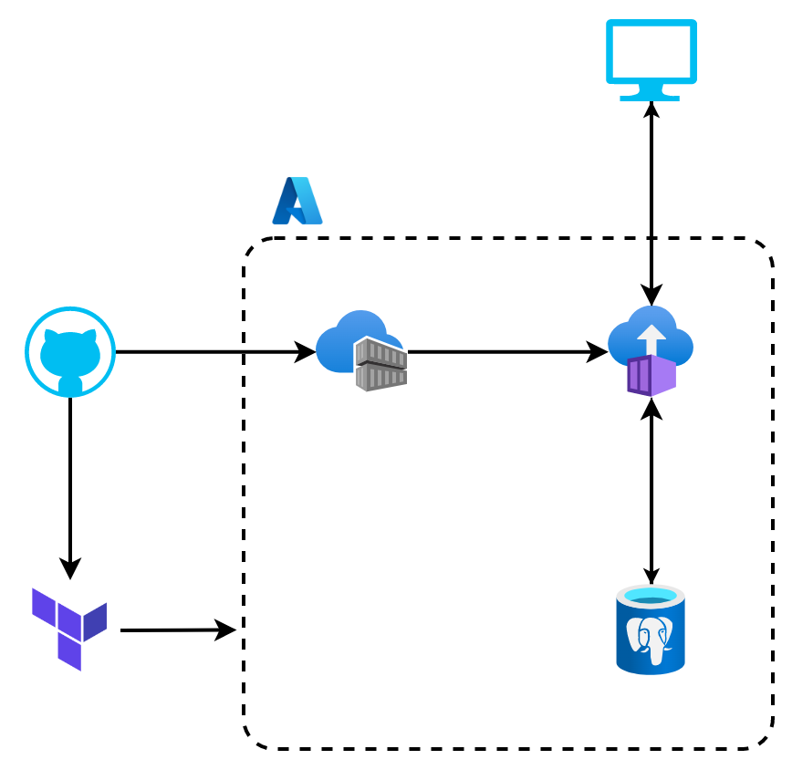
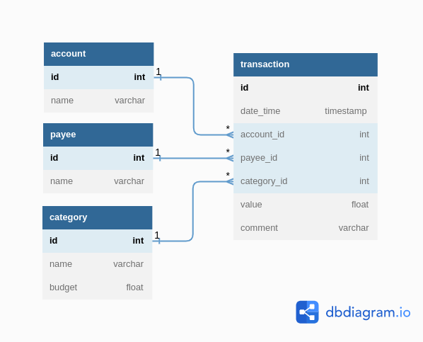

# App Budget

## Description

This repository holds the source code for App Budget. App Budget is a CRUD API that I created for transaction tracking and budgeting using Python, FastAPI, SQL and PostgreSQL. It is deployed to Azure using Terraform, docker and GitHub Actions. You can access the API documentation [here](http://app-budget.eastus.azurecontainer.io/docs).

## I'm completely lost, where should I start?

If you want to **consume the API**, check the API documentation [here](http://app-budget.eastus.azurecontainer.io/docs).

If you want to **set up the project** on your machine for developing, check the [... Set up the project using devcontainer](#set-up-the-project-using-devcontainer) and [... Serve locally](#serve-the-app-locally) sections.

If you want to **understand the code**, check the `app/main.py` file and the `app/router/` folder.

If you want to **understand the infrastructure**, check the `main.tf` file.

## How to ...

### ... Set up the project using devcontainer

You can develop the project inside a container by following these steps in VSCode:

1. Open VSCode
1. Install the [devcontainer](https://marketplace.visualstudio.com/items?itemName=ms-vscode-remote.remote-containers) extension
1. Open the command palette (press `F1` key), select the command `Git: Clone` (you may need to type it) and clone this repository https://github.com/GiuseppeTT/app-budget.git
1. Create the file `.env` to set up the necessary environment variables by using the file `.env.example` as a guide
1. Open the command palette (press `F1` key) and select the command `Dev Containers: Open Folder in Container...` (you may need to type it)

After that, the project will be all set up.

> **Note:** You may need to install [docker](https://www.docker.com/) first.

> **Note:** You can check more instructions on the [devcontainer documentation](https://code.visualstudio.com/docs/devcontainers/containers).

### ... Test the API locally

To test the API locally, simply run `. script/app-test.sh`

> **Note:** You will probably need to add your IP address to the database service in order to connect to it locally (necessary for testing locally).

> **Note:** There is a CI/CD workflow (`.github/workflows/test-app.yaml`) set up to test the API at any push to main or open pull request.

### ... Lint / format the python files / types locally

To format the python files locally, simply run `. script/python-format-files.sh`

> **Note:** There is a CI/CD workflow (`.github/workflows/run-pre-commit-hooks.yaml`) set up to run the pre-commit hooks (which include a check for format consistency) at any push to main or open pull request.

To lint the python files locally, simply run `. script/python-lint-files.sh`

> **Note:** There is a CI/CD workflow (`.github/workflows/lint-python-files.yaml`) set up to lint the python files at any push to main or open pull request.

To lint the python types locally, simply run `. script/python-lint-types.sh`

> **Note:** There is a CI/CD workflow (`.github/workflows/lint-python-types.yaml`) set up to lint the python types at any push to main or open pull request.

### ... Serve the API locally

To serve the API locally, simply run `. script/app-serve.sh`

After that, you can check the endpoints at `http://localhost:8000/docs` (it maybe another host:port in devcontainer).

### ... Build the docker image and run locally

To build the docker image and run it locally to serve the API, simply run `. script/docker-build-image.sh` and then `. script/docker-run-container.sh`

After that, you can check the endpoints at `http://0.0.0.0:80/docs` (it maybe another host:port in devcontainer).

### ... Deploy

There is no manual deployment. The API is automatically deployed to Azure every time a commit is pushed to main (only possible through pull requests). You can check the CI/CD workflow responsible for that at `.github/workflows/deploy-app.yaml`

## Infrastructure architecture diagram



> **Note:** The diagram was created using [draw.io](https://dbdiagram.io/). You can check the source file at `figure/infrastructure_architecture_diagram.drawio`.

## Database entity relationship (ER) diagram



> **Note:** The diagram was created using [dbdiagram.io](https://dbdiagram.io/)

## Repository structure

```
.
├── .devcontainer/           # Devcontainer's files
├── .git/                    # [Git ignored] [Auto generated] Git files
├── .github/workflows/       # GitHub Actions's workflows (CI / CD)
├── .mypy_cache/             # [Git ignored] [Auto generated] Mypy's cache
├── .pytest_cache/           # [Git ignored] [Auto generated] Pytest's cache
├── .terraform/              # [Git ignored] [Auto generated] Terraform's files
├── .venv/                   # [Git ignored] [Auto generated] Python virtual environment
├── .vscode/                 # VSCode's configurations
├── app/                     # App's code
│   ├── crud/                # CRUD's code
│   ├── model/               # Model's code (input data, database data, output data, and update data)
│   ├── router/              # Endpoints's code
│   ├── test/                # App's tests
│   ├── config.py            # App's configurations
│   ├── database.py          # Database's code
│   ├── dependency.py        # Dependency injection's code
│   └── main.py              # Responsible for defining the app and connecting all the app's code
├── script/                  # Auxiliary scripts, mainly for doing things locally
├── .env                     # [Git ignored] List of environment variables, mainly for secrets
├── .env.example             # Example of .env file
├── .gitignore               # List of files ignored by git
├── .pre-commit-config.yaml  # Pre-commit's configurations
├── .terraform.lock.hcl      # [Auto generated] Terraform's lock file
├── Dockerfile               # Docker image instructions
├── LICENSE                  # Project's license
├── poetry.lock              # [Auto generated] Python dependency versions
├── README.md                # This very file you are reading
├── debug.py                 # [Git ignored] An auxiliary script for debugging, like a whiteboard
├── main.tf                  # Terraform's code, cloud resources
├── outputs.tf               # Terraform's code, outputs
├── variables.tf             # Terraform's code, variables, some of them are sensitive and provided through environment variables
├── poetry.toml              # [Auto generated] Poetry's configurations
└── pyproject.toml           # Project's configurations
```
